# Facebook Launch Guide: "Winter vol Liefde" Campaign

Hi Jan and Vanessa! This guide is designed to be a "step-by-step" checklist to help you launch your first digital campaign. Don't worry about the technical side—we've already built the foundation.

---

## 🎨 The Simple Campaign Flow
Here is what happens in simple terms:

```mermaid
graph TD
    A[Facebook Post] -->|Click Link| B[Landing Page]
    B -->|Click 'Buy Voucher'| C[Payment Page]
    C -->|Success| D[Happy Customer + 💰]
```

---

## 🚀 Step 1: Prepare Your Materials

### 1. The Visuals (The "Photos")
Pick **6 photos** from your phone/camera—one for each alpaca:
- Elvis (White), Micky (Brown), Suri (Fawn), Teddy (Leader), Ricky (Singer), Freddy (Charmer).

### 2. The Text (The "Caption")
Open [social-media-templates.md](file:///f:/New%20Alpaca%20Site/ZAPnew2/docs/campaigns/social-media-templates.md) and copy the text for **Day 1**. It's already in Dutch and ready to go!

---

## 🛠️ Step 2: How to "Trial Run" (Testing)

If you're nervous about posting to your 25,000+ followers immediately, do this:

1.  **Private Post**: When you create the post on Facebook, change the audience from **"Public"** to **"Only Me"**.
2.  **Verify**: Publish it. Only you (and Vanessa) can see it. 
3.  **Check the Link**: Click the link in the post. Does it lead to [the landing page](http://localhost:3002/nl/winter-vol-liefde)? 
4.  **Confirm**: If it looks good, change the audience back to **"Public"** to officially launch it!

---

## 📱 Step 3: Posting to Facebook (Real Launch)

1.  **Create Post**: Upload your 6 photos as an **Album/Carousel**.
2.  **Paste Caption**: Paste the text I wrote for you.
3.  **The "Magic" Link**: Make sure the link `https://zagrodaalpakoterapii.com/nl/winter-vol-liefde` is at the end of the post.
4.  **Tag Location**: Tag "Zagroda Alpakoterapii".
5.  **Hit Publish!**

---

## 📈 Step 4: What to Watch For
After you post, look for:
-   **Comments**: People will likely tag their friends (e.g., "Look at Ricky!").
-   **Shares**: This is free advertising!
-   **Sales**: Keep an eye on your Stripe dashboard—that's where the "results" will show up.

> [!TIP]
> **Vanessa's Pro-Tip**: After you post, reply to the first few comments with a heart emoji `❤️`. Facebook's algorithm loves it when the page owner interacts with people!

Good luck! You've got this! 🦙💕
